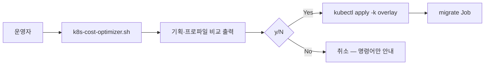

# Kubernetes 배포 가이드

Crewlink를 Kubernetes에 배포하고, **비용 최소화 기획을 검토한 뒤 실행 여부를 직접 결정**하는 방법입니다.

기존 [DEPLOY.md](../DEPLOY.md)의 Vercel + Fly.io + Neon 경로와 병행 가능합니다.

---

## 1. 구조

```
k8s/
  base/                 # 공통 매니페스트 (backend, frontend, gateway, redis, HPA)
  overlays/
    minimal/            # 비용 최소 (권장)
    standard/           # 2 replica 운영
    bundled-db/         # in-cluster Postgres (POC, 비용↑)
  extras/               # 선택: 야간 scale-down, Spot toleration
  cost-plan.yaml        # 비용 기획 정의
scripts/
  k8s-cost-optimizer.sh # 기획 출력 → y/N 확인 → 적용
  k8s-deploy.sh         # 이미지 빌드 + 배포 래퍼
```



---

## 2. 사전 준비

- Kubernetes 클러스터 (EKS, GKE, AKS, k3s 등)
- `kubectl` 연결 완료
- (권장) **Neon** 등 관리형 Postgres — `minimal`/`standard` 프로파일
- 컨테이너 레지스트리 (선택): 이미지 push 후 `k8s/base/kustomization.yaml`의 `images` 수정

### Secret 설정

```bash
cp k8s/base/secret.example.yaml k8s/base/secret.yaml
# DB_HOST, DB_PASSWORD, JWT_SECRET, SECRET_KEY_BASE 등 입력
```

`secret.yaml`은 git에 커밋하지 않습니다.

---

## 3. 이미지 빌드

```bash
docker build -t crewlink/backend:latest site_backend
docker build -t crewlink/frontend:latest outsourcing_site

# 원격 레지스트리 예시
docker tag crewlink/backend:latest ghcr.io/YOU/crewlink-backend:latest
docker push ghcr.io/YOU/crewlink-backend:latest
```

---

## 4. 비용 최소화 기획 (실행 여부 직접 결정)

### 4-1. 기획만 보기

```bash
chmod +x scripts/k8s-cost-optimizer.sh scripts/k8s-deploy.sh
./scripts/k8s-cost-optimizer.sh --plan-only
```

프로파일별 예상 비용·권장 사항이 출력됩니다.

### 4-2. 대화형 적용 (기본)

```bash
./scripts/k8s-cost-optimizer.sh
```

1. 프로파일 비교표 출력
2. `1` minimal / `2` standard / `3` bundled-db 선택
3. **「위 기획을 클러스터에 적용하시겠습니까? [y/N]」** — `N`이 기본값
4. `y` 입력 시에만 `kubectl apply` 실행

### 4-3. 프로파일 지정

```bash
./scripts/k8s-cost-optimizer.sh --profile minimal   # 선택 후 y/N
./scripts/k8s-cost-optimizer.sh --profile minimal --yes  # 확인 없이 적용
```

### 4-4. 프로파일 요약

| 프로파일 | 월 예상 | 특징 |
|---------|--------|------|
| **minimal** | $25–60 | Backend 1, ClusterIP gateway, 작은 Redis — **권장** |
| **standard** | $80–180 | Backend/Frontend 2, HPA max 3 |
| **bundled-db** | $120–250 | in-cluster Postgres — POC만 |

상세 기획: [k8s/cost-plan.yaml](../k8s/cost-plan.yaml)

---

## 5. 수동 배포

```bash
kubectl apply -f k8s/base/secret.yaml
kubectl apply -k k8s/overlays/minimal
kubectl apply -f k8s/base/migrate-job.yaml
kubectl wait --for=condition=complete job/backend-migrate -n crewlink --timeout=120s
kubectl get pods -n crewlink
```

Ingress 사용 시:

```bash
kubectl apply -f k8s/base/ingress.yaml
```

`minimal` 오버레이는 gateway Service를 **ClusterIP**로 바꿔 LoadBalancer 비용을 줄입니다.

---

## 6. 선택적 추가 절감

| 항목 | 파일 | 설명 |
|------|------|------|
| 야간 scale-down | `k8s/extras/cron-scale-down.yaml` | 23시 0 replica, 평일 8시 1 replica |
| Spot 노드 | `k8s/extras/spot-toleration.yaml` | Spot 풀 toleration 패치 예시 |

**주의:** CronJob scale-down은 트래픽이 없는 환경에서만 사용하세요.

---

## 7. 운영 명령

```bash
# 상태
kubectl get all -n crewlink

# 로그
kubectl logs -f deployment/backend -n crewlink

# 롤링 업데이트 (이미지 변경 후)
kubectl rollout restart deployment/backend -n crewlink

# 삭제
kubectl delete namespace crewlink
```

---

## 8. CI 연동 (선택)

매니페스트 검증:

```bash
kubectl kustomize k8s/overlays/minimal | kubectl apply --dry-run=client -f -
```

GitHub Actions에 `kubeconform` 또는 위 dry-run을 추가할 수 있습니다.

---

## 9. Fly.io / Vercel과 비교

| 항목 | Fly + Vercel + Neon | K8s minimal |
|------|---------------------|-------------|
| 운영 복잡도 | 낮음 | 중간 |
| 최소 비용 | ~$0–30/월 | ~$25–60/월 (클러스터 비용 포함) |
| 확장 | Fly scale | HPA + 노드 풀 |
| 적합 | 소규모 SaaS | 이미 K8s 인프라 보유 팀 |

팀에 Kubernetes가 이미 있으면 `minimal` 프로파일 + 외부 Neon DB 조합을 권장합니다.
